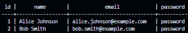

# LHL Midterm Project: QuizQuest

Here are notes related to the LHL midterm group project. This app is a collaborative project showcasing the group work and programming skills of the Lighthouse Labs student team. The team has chosen to work on the Quiz App. An app that lets you create quizzes and share them between friends. The creator of the quiz can view and share all the results at the end of the quiz.

## Project Authors

- Darshita ([@Darshita-04](https://github.com/Darshita-04))
- James ([@ArcaneCipher](https://github.com/ArcaneCipher))
- Javin ([@h1tokiri](https://github.com/h1tokiri))
- Kattt ([@Kattt888](https://github.com/Kattt888))

The repo: <https://github.com/ArcaneCipher/QuizQuest>

## Table of Contents

- [About the Learning](#about-the-learning)
- [About the Midterm Project](#about-the-midterm-project)
- [Project Outcomes](#project-outcomes)
- [Project Structure](#project-structure)
- [Project Stack Requirements](#project-stack-requirements)
- [Tech Stack](#tech-stack)
- [Scope Definition](#scope-definition)
  - [LHL Project Requirements](#lhl-project-requirements)
  - [User Stories](#user-stories)
  - [Minimum Viable Product](#minimum-viable-product-mvp)
  - [Stretch Features](#stretch-features)
- [Database design and ERDs](#database-design-and-erds)
  - [Entities](#entities)
  - [Entity-Relationship Diagram (ERD)](#entity-relationship-diagram-erd)
- [Wireframes](#wireframes)
- [Workflow (Git)](#workflow-git)
  - [Initial Setup](#initial-setup)
  - [Starting Your Day’s Work](#starting-your-days-work)
  - [Working on Your Feature Branch](#working-on-your-feature-branch)
  - [Collaborating with the Team](#collaborating-with-the-team)
  - [Merging and Resolving Conflicts](#merging-and-resolving-conflicts)
  - [End-of-Day Practices](#end-of-day-practices)
  - [Tips for Success](#tips-for-success)
- [Work separation and organization](#work-separation-and-organization)
  - [Project File Tree](#project-file-tree)

## About the Learning

The midterm project is an evaluated project designed to prepare learners for job readiness by addressing the hard and soft skills needed to be successful on the job.

Hard skills are defined by the technical skills learners acquired in modules 1 through 5. For job readiness purposes, the project shifts away from the fully defined projects learners have been doing in the previous modules and instead requires learners to apply their learning from those modules into a project-based learning opportunity.

The soft skills are defined by the job readiness skills needed of a web developer in role. The midterm will simulate a working environment by providing supports and structure similar to on the job with communication, collaboration, and project management emphasized. Learners will have the opportunity to work collaboratively in a group setting, whilst developing the individual soft skills needed to be successful as a web developer in role, beyond their technical skillset, all whilst being supported by an instructor acting as the work manager.

[Top](#table-of-contents)

## About the Midterm Project

In this project, learners will:

- Build a web app from start to finish using the tech and approaches learned to date
- Turn requirements into a working product
- Practice architecting an app in terms of UI/UX, Routes/API and Database
- Manage a multi-developer project with git
- Simulate the working world where you do not always get to select your team, stack or product features
- Collaborate, communicate, project manage
- Simulate on the job structures and supports
- Practice demoing an app in a presentation to help prepare for the final project and employer interviews

[Top](#table-of-contents)

## Project Outcomes

In completing this project, learners will be able to:

- Use git best practices (sans rebase) when working on a project with multiple members (branching, merging, and doing those often) as well as the github workflow (pull requests).
- Use the major steps of software development to execute the project; user stories, wireframes, ERD, Routes, etc.
- Collaborate with team members to decide how to break out the work, set good team structure, and dynamic.
- Engage in a simulated on the job environment
- Prepare and plan how to tailor communication and presentation approach for a technical and non-technical audience
- Present a web development project to a technical and non-technical audience

[Top](#table-of-contents)

## Project Structure

- Groups are selected by the Education team
- 2 week period (weeks 14 & 15 of the program)
- Week 15 Saturday Demo presentation
- Midterm Kick off lecture on software project execution strategies
- Each group member is to make Git comments on their commits (to reflect individual contributions to the group project)
- Instructor assigned to a group as manager
- Group reports into this instructor during designated times (2x per week minimum)
- Daily Slack Scrums

[Top](#table-of-contents)

## Project Stack Requirements

Groups must use the Stack requirements listed below.

### Project must use

- ES6 for server-side (NodeJS) code
- NodeJS
- Express
  - RESTful routes
- One or more CSS or UI "framework"s:
  - jQuery
  - A CSS preprocessor such as SASS, Stylus, or PostCSS for styling -- or CSS Custom properties and no CSS preprocessor
- PostgreSQL and pg (with promises) for DBMS
- git for version control

### Optional Requirements

- SPA (Single-Page Application) Behaviour
- Hosting, such as Railway.app, netlify, github pages, AWS, or Azure

[Top](#table-of-contents)

## Tech stack

1. Front-End:

   - HTML/CSS: Basic structure and styling.
   - JavaScript & jQuery: Dynamic interactivity.
   - AJAX: Asynchronous data fetching without page reloads.

2. Back-End:

   - Node.js: Server-side JavaScript.
   - Express.js: Framework for handling routes and server logic.

3. Database:

   - PostgreSQL: To store user data, quizzes, and results.

4. Other Tools:
   - EJS: Templating engine for rendering dynamic pages.
   - Bootstrap: For quick, responsive styling.

[Top](#table-of-contents)

## Scope Definition

Defining the scope, which includes user stories and MVP

### LHL Project Requirements

- users can create quizzes
- users can make their quiz unlisted (make them private and not available on the home page, but if someone knows the quiz URL they can visit and take the quiz)
- users can share a link to a single quiz
- users can see a list of public quizzes
- users can see a list of public quizzes on the home page
- users can attempt a quiz
- users can see the results of their recent attempt
- users can share a link to the result of their attempt

### User Stories

1. As a user, I want to create a quiz with custom questions and answers.
2. As a user, I want to make my quiz public or private.
3. As a user, I want to share my quiz with friends using a unique URL.
4. As a user, I want to attempt quizzes and see my score afterward.
5. As a user, I want to view a list of public quizzes on the homepage.

### Minimum Viable Product (MVP)

1. Create quizzes with custom questions and answers.
2. See list of public quizes.
3. Share quizzes using unique URLs.
4. Attempt quizzes and view results.
5. Share link to quiz attempt result.

### Stretch Features

1. User authentication for managing quizzes and attempts.
2. Analytics for quiz creators (e.g., number of attempts, average scores).
3. Timer for quiz attempts.

[Top](#table-of-contents)

## Database design and ERDs

### Entities

**users:**

- id (PK)
- name
- email
- password (hashed)



**quizzes:**

- id (PK)
- creator_id (FK, references users.id)
- title
- description
- is_public (boolean)
- quiz_url (randomly generated alphanumeric string)
- category


**questions:**

- id (PK)
- quiz_id (FK, references quizzes.id)
- question


**answers:**

- id (PK)
- question_id (FK, references questions.id)
- answer
- is_correct (boolean)


**results:**

- id (PK)
- user_id (FK, references users.id)
- quiz_id (FK, references quizzes.id)
- score (calculated by count true for answers)
- question_total (calculated from question count by quiz_id)
- attempt_url (randomly generated alphanumeric string)


**user_answers:**

- id (PK)
- result_id (FK, references results.id)
- question_id (FK, references questions.id)
- selected_answer_id (FK, references answers.id)
- is_correct (boolean from answers.is_correct)


### Entity-Relationship Diagram (ERD)

1. users are connected to quizzes (1-to-many).
2. users are connected to results (1-to-many), which track quiz scores.
3. quizzes are connected to questions (1-to-many).
4. quizzes are connected to results (1-to-many).
5. quizzes are connected to user_answers (1-to-many).
6. questions are connected to answers (1-to-many).
7. answers are connected to user_answers (1-to-many).

    

[Top](#table-of-contents)

## Wireframes

This will need to be mocked up

Home Page:

- List of public quizzes.
  Search bar to find quizzes.

  

Create Quiz Page:

- Input fields for title and description.
- Section to add questions and answers dynamically.

  

Attempt Quiz Page:

- Display questions with multiple-choice answers.
- Submit button to calculate score.

Result Page:

- Display user score with a shareable link.

[Top](#table-of-contents)

## Workflow (Git)

### **Team Collaboration Workflow for GitHub and VSCode**

This workflow ensures that everyone stays in sync and reduces the risk of conflicts, enabling your team to collaborate smoothly.

#### **Initial Setup**

1. **Clone the Repository:**

   - If you haven’t already, clone the repository to your local machine.

     ```bash
     git clone git@github.com:ArcaneCipher/QuizQuest.git
     cd QuizQuest
     ```

   - Open the project folder in VSCode.

2. **Set Up the Upstream Remote:**

   - Ensure your local repo is linked to the main repository (upstream).

     ```bash
     git remote add upstream git@github.com:ArcaneCipher/QuizQuest.git
     ```

   - Check remotes:

     ```bash
     git remote -v
     ```

3. **Install Optional Extensions:**

   - Install the **GitLens** and **GitHub Pull Requests and Issues** extensions in VSCode for better Git integration and visualization.

[Workflow Top](#table-of-contents)

---

#### **Starting Your Day’s Work**

1. **Pull the Latest Changes:**

   - Before starting work, ensure your local main branch is up-to-date.

     ```bash
     git checkout main
     git pull upstream main
     ```

   - This syncs your local `main` branch with the main repository on GitHub.

2. **Create a Feature Branch:**

   - Always create a new branch for the task/feature you’re working on.

     ```bash
     git checkout -b <feature-branch-name>
     ```

   - Use descriptive branch names (e.g., `feature/quiz-sharing` or `fix/question-ordering`).

[Workflow Top](#table-of-contents)

---

#### **Working on Your Feature Branch**

1. **Make Commits:**

   - Write meaningful commit messages for every change you make.

     ```bash
     git add <file>
     git commit -m "Add feature to share quizzes"
     ```

   - Commit often, but ensure each commit represents a logical unit of work.

2. **Push Your Branch to GitHub:**

   - Push your feature branch to the repository so others can see your work.

     ```bash
     git push origin <feature-branch-name>
     ```

[Workflow Top](#table-of-contents)

---

#### **Collaborating with the Team**

1. **Create a Pull Request (PR):**

   - Once your feature is complete, create a pull request from GitHub:
     - Go to the repository → Click "Pull Requests" → Click "New Pull Request."
   - Assign reviewers and add a description of the changes.

2. **Review and Test:**

   - Review each other's PRs for code quality and functionality.
   - Approve or suggest changes before merging.

3. **Sync Frequently:**

   - If others are pushing changes to the `main` branch, sync your branch regularly:

     ```bash
     git fetch upstream git merge upstream/main
     ```

   - Resolve any conflicts locally before pushing updates to your feature branch.

[Workflow Top](#table-of-contents)

---

#### **Merging and Resolving Conflicts**

1. **Merge the PR:**

   - After approval, merge the pull request on GitHub.

2. **Handle Merge Conflicts:**

   - If conflicts arise during merging:
     - VSCode highlights conflicts in the editor.
     - Choose which changes to keep or manually edit the files.
   - After resolving, mark the conflicts as resolved:

     ```bash
     git add <file>
     git commit
     ```

   - Push the resolved branch:

     ```bash
     git push origin <feature-branch-name>
     ```

[Workflow Top](#table-of-contents)

---

#### **End-of-Day Practices**

1. **Clean Up:**

   - Delete merged branches both locally and remotely to keep things organized.

     ```bash
     git branch -d <feature-branch-name>
     git push origin --delete <feature-branch-name>
     ```

2. **Document Changes:**

   - Update any relevant documentation or comments to reflect the day’s work.

[Workflow Top](#table-of-contents)

---

### **Tips for Success**

- **Branch Naming Convention:** Use prefixes like `feature/`, `bugfix/`, or `hotfix/` for clarity.
- **Commit Messages:** Use present-tense and descriptive messages (e.g., "Add functionality for quiz scoring").
- **Pull Requests:** Keep PRs small and focused on a single feature or fix for easier review.
- **Sync Often:** Regularly pull from `main` to avoid large conflicts.
- **Communication:** Use comments in GitHub or a team communication tool (like Slack) to clarify questions or decisions.
- **Backup Work:** If you’re working on an experimental branch, push it to GitHub as a draft for safety.

[Workflow Top](#table-of-contents)

---

[Top](#table-of-contents)

## Work separation and organization

(To be included in next revision)

### Project File Tree

```sql
.
├── README.md
├── bin
│   └── resetdb.js <---- called with: `npm run db:reset`
├── db
│   ├── QuizQuest_ERD.drawio <---- ERD diagram
│   ├── connection.js <----------- pg db config settings
│   ├── queries <----------------- database queries
│   │   └── users.js
│   ├── schema <------------------ schema files
│   │   └── quizquest_schema.sql
│   └── seeds <------------------- seed data files
│       ├── 01_users_seeds.sql
│       ├── 02_quizzes_seeds.sql
│       ├── 03_questions_seeds.sql
│       ├── 04_answers_seeds.sql
│       └── 05_attempts_seeds.sql
├── lib <------------------------- app middleware
│   └── sass-middleware.js
├── node_modules
│   └── <trimmed out the tree>
├── package-lock.json
├── package.json
├── project-details.md <---------- project documentation
├── public
│   ├── scripts <----------------- app js scripts
│   │   ├── app.js <-------------- client facing scripts
│   │   └── users.js <------------ client facing scripts
│   ├── styles <------------------ app css styles
│   │   ├── layout.css
│   │   └── main.css
│   └── vendor
│       ├── border-box.css
│       ├── jquery-3.0.0.js
│       ├── normalize-4.1.1.css
│       └── bootstrap
│           ├── bootstrap.bundle.min.js
│           └── bootstrap.min.css
├── routes <---------------------- route & API scripts
│   ├── users-api.js <------------ routes for User Data
│   ├── users.js <---------------- routes for Users
│   └── widgets-api.js <---------- routes for Widget Data
├── screenshots <----------------- project screenshots
│   └── <trimmed out the tree>
├── server.js <------------------- called with: `npm run local`
├── styles <---------------------- SASS styling
│   ├── layout.scss
│   └── main.scss
└── views <----------------------- app views/ejs html files
    ├── index.ejs
    └── users.ejs

361 directories, 1581 files
```

[Top](#table-of-contents)
