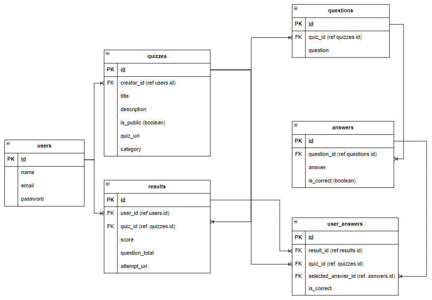

# LHL Midterm Project: QuizQuest

Here are notes related to the LHL midterm group project. This app is a collaborative project showcasing the group work and programming skills of the Lighthouse Labs student team. The team has chosen to work on the Quiz App. An app that lets you create quizzes and share them between friends. The creator of the quiz can view and share all the results at the end of the quiz.

## Project Authors

- Darshita ([@Darshita-04](https://github.com/Darshita-04))
- James ([@ArcaneCipher](https://github.com/ArcaneCipher))
- Javin ([@h1tokiri](https://github.com/h1tokiri))
- Kattt ([@Kattt888](https://github.com/Kattt888))

The repo: <https://github.com/ArcaneCipher/QuizQuest>

## Table of Contents

- [About the Learning](#about-the-learning)
- [About the Midterm Project](#about-the-midterm-project)
- [Project Outcomes](#project-outcomes)
- [Project Structure](#project-structure)
- [Stack Requirements](#stack-requirements)
- [Tech Stack](#tech-stack)
- [Scope Definition](#scope-definition)
  - [LHL Project Requirements](#lhl-project-requirements)
  - [User Stories](#user-stories)
  - [Minimum Viable Product](#minimum-viable-product-mvp)
  - [Stretch Features](#stretch-features)
- [Database design and ERDs](#database-design-and-erds)
  - [Entities](#entities)
  - [Entity-Relationship Diagram (ERD)](#entity-relationship-diagram-erd)
- [Wireframes](#wireframes)
- [Workflow (Git)](#workflow-git)
- [Work separation and organization](#work-separation-and-organization)

## About the Learning

The midterm project is an evaluated project designed to prepare learners for job readiness by addressing the hard and soft skills needed to be successful on the job.

Hard skills are defined by the technical skills learners acquired in modules 1 through 5. For job readiness purposes, the project shifts away from the fully defined projects learners have been doing in the previous modules and instead requires learners to apply their learning from those modules into a project-based learning opportunity.

The soft skills are defined by the job readiness skills needed of a web developer in role. The midterm will simulate a working environment by providing supports and structure similar to on the job with communication, collaboration, and project management emphasized. Learners will have the opportunity to work collaboratively in a group setting, whilst developing the individual soft skills needed to be successful as a web developer in role, beyond their technical skillset, all whilst being supported by an instructor acting as the work manager.

[Top](#table-of-contents)

## About the Midterm Project

In this project, learners will:

- Build a web app from start to finish using the tech and approaches learned to date
- Turn requirements into a working product
- Practice architecting an app in terms of UI/UX, Routes/API and Database
- Manage a multi-developer project with git
- Simulate the working world where you do not always get to select your team, stack or product features
- Collaborate, communicate, project manage
- Simulate on the job structures and supports
- Practice demoing an app in a presentation to help prepare for the final project and employer interviews

[Top](#table-of-contents)

## Project Outcomes

In completing this project, learners will be able to:

- Use git best practices (sans rebase) when working on a project with multiple members (branching, merging, and doing those often) as well as the github workflow (pull requests).
- Use the major steps of software development to execute the project; user stories, wireframes, ERD, Routes, etc.
- Collaborate with team members to decide how to break out the work, set good team structure, and dynamic.
- Engage in a simulated on the job environment
- Prepare and plan how to tailor communication and presentation approach for a technical and non-technical audience
- Present a web development project to a technical and non-technical audience

[Top](#table-of-contents)

## Project Structure

- Groups are selected by the Education team
- 2 week period (weeks 14 & 15 of the program)
- Week 15 Saturday Demo presentation
- Midterm Kick off lecture on software project execution strategies
- Each group member is to make Git comments on their commits (to reflect individual contributions to the group project)
- Instructor assigned to a group as manager
- Group reports into this instructor during designated times (2x per week minimum)
- Daily Slack Scrums

[Top](#table-of-contents)

## Stack Requirements

Groups must use the Stack requirements listed below. Your projects must use:

- ES6 for server-side (NodeJS) code
- NodeJS
- Express
    - RESTful routes
- One or more CSS or UI "framework"s:
    - jQuery
    - A CSS preprocessor such as SASS, Stylus, or PostCSS for styling -- or CSS Custom properties and no CSS preprocessor
- PostgreSQL and pg (with promises) for DBMS
- git for version control

Optional Requirements

- SPA (Single-Page Application) Behaviour
- Hosting, such as Railway.app, netlify, github pages, AWS, or Azure

[Top](#table-of-contents)

## Tech stack

1. Front-End:
    - HTML/CSS: Basic structure and styling.
    - JavaScript & jQuery: Dynamic interactivity.
    - AJAX: Asynchronous data fetching without page reloads.

2. Back-End:
    - Node.js: Server-side JavaScript.
    - Express.js: Framework for handling routes and server logic.

3. Database:
    - PostgreSQL: To store user data, quizzes, and results.

4. Other Tools:
    - EJS: Templating engine for rendering dynamic pages.
    - Bootstrap: For quick, responsive styling.

[Top](#table-of-contents)

## Scope Definition

Defining the scope, which includes user stories and MVP

### LHL Project Requirements

- users can create quizzes
- users can make their quiz unlisted (make them private and not available on the home page, but if someone knows the quiz URL they can visit and take the quiz)
- users can share a link to a single quiz
- users can see a list of public quizzes
- users can see a list of public quizzes on the home page
- users can attempt a quiz
- users can see the results of their recent attempt
- users can share a link to the result of their attempt

### User Stories

1. As a user, I want to create a quiz with custom questions and answers.
2. As a user, I want to make my quiz public or private.
3. As a user, I want to share my quiz with friends using a unique URL.
4. As a user, I want to attempt quizzes and see my score afterward.
5. As a user, I want to view a list of public quizzes on the homepage.

### Minimum Viable Product (MVP)

1. Create quizzes with custom questions and answers.
2. See list of public quizes.
3. Share quizzes using unique URLs.
4. Attempt quizzes and view results.
5. Share link to quiz attempt result.

### Stretch Features

1. User authentication for managing quizzes and attempts.
2. Analytics for quiz creators (e.g., number of attempts, average scores).
3. Timer for quiz attempts.

[Top](#table-of-contents)

## Database design and ERDs

### Entities

Users:

- id (PK)
- name
- email
- password (hashed)

Quizzes:

- id (PK)
- title
- description
- is_public (boolean)
- creator_id (FK, references Users.id)

Questions:

- id (PK)
- quiz_id (FK, references Quizzes.id)
- text

Answers:

- id (PK)
- question_id (FK, references Questions.id)
- text
- is_correct (boolean)

Attempts:

- id (PK)
- user_id (FK, references Users.id)
- quiz_id (FK, references Quizzes.id)
- score

### Entity-Relationship Diagram (ERD)

1. Users are connected to Quizzes (1-to-many).
2. Quizzes are connected to Questions (1-to-many).
3. Questions are connected to Answers (1-to-many).
4. Users are connected to Attempts (1-to-many), which track quiz scores.

[Top](#table-of-contents)

## Wireframes

This will need to be mocked up

Home Page:

- List of public quizzes.
Search bar to find quizzes.

Create Quiz Page:

- Input fields for title and description.
- Section to add questions and answers dynamically.

Attempt Quiz Page:

- Display questions with multiple-choice answers.
- Submit button to calculate score.

Result Page:

- Display user score with a shareable link.

[Top](#table-of-contents)

## Workflow (Git)

(To be included in next revision)

> Setting up the GitHub repository. Workflow is probably someone setting up the repo "QuizApp" (unless we wanna call it something else). Branching likely a "main" for stable/production ready code, "dev" branch for staging and integrating features. Then specific feature branches like "feature/create-quiz" or "feature/view-result" when we're working on those features.

[Top](#table-of-contents)

## Work separation and organization

(To be included in next revision)

> "who is responsible for what, and status tracking using tools like Trello, etc."
> 
> For Work separation/organization I think we'll have a better idea when we sit down and map out/plan/architect the app framework. Then we can divvy out features to work on. We'll have to figure out how often we want to meet as a team for code reviews before merging to main and for peer coding sessions. Fortunately there are no other lectures to worry about at that time.

[Top](#table-of-contents)
